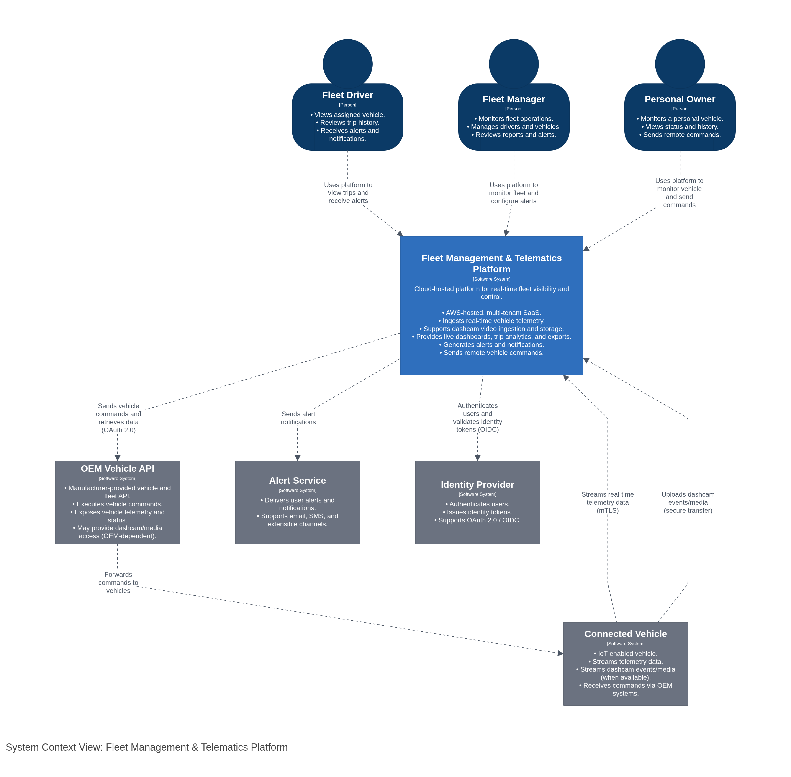
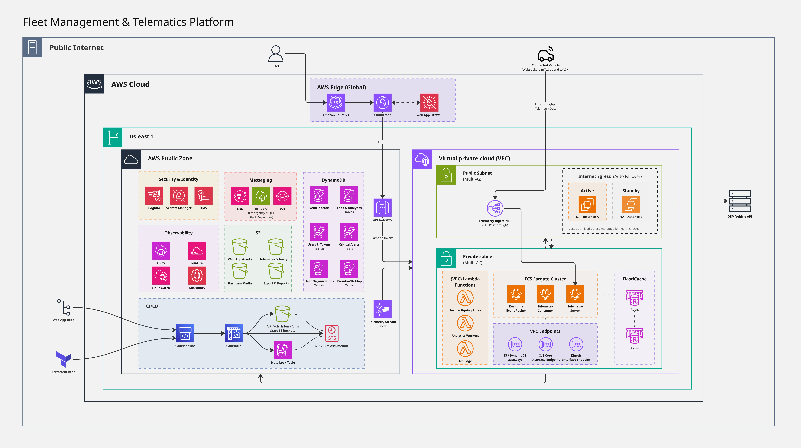

# Real-time Fleet Management & Telematics Platform - AWS Architecture Documentation
A production-grade, event-driven AWS architecture for real-time vehicle telemetry processing and fleet management.

---

## Overview
This repository is a **design-first, infrastructure-as-code (IaC) case study** showcasing cloud architecture, system design tradeoffs, Terraform practices, and operational readiness for a large-scale telemetry platform. 
It documents how I would design, secure, deploy, and operate a large-scale fleet management and telematics platform capable of servicing tens of thousands of real-time vehicle events per second.

**Data Source:** This architecture utilizes [Tesla's Fleet Telemetry & Vehicle APIs](https://github.com/teslamotors/fleet-telemetry) - the most mature OEM streaming API available to general consumers today. As automakers like Tesla and Volvo increasingly open telemetry access, this starts to becomes the future of fleet management solutions. This eliminates the need for any aftermarket hardware upfront costs or installations, offers richer data, and significantly reduces operational costs. The Tesla-specific components are isolated to the ingestion layer and vehicle command endpoint; the architecture patterns apply to any high volume telemetry source beyond that.

**The scope of this repository includes:**
- System design & architecture tradeoffs.
- Event-driven, scalable AWS patterns.
- Terraform (IaC) structure & practices.
- Security, reliability, & operational readiness.
  
**Out of the scope**
- Frontend and application code.
- Business logic implementation.
- Live app or data.

**Note:** This is an architectural case study, not a full application codebase. The application showcase and source code will be released in separate repositories in the future.

### The Startup Lens
I'm approaching this architecture from a startup perspective, prioritizing cost efficiency while minimizing performance or reliability degradation. While enterprise-scale solutions might choose differently, every decision here balances capability against budget constraints.

**Target Scale:**
| Metric | Target |
|--------|--------|
| Peak Telemetry Events | 10,000+ events/sec |
| API P99 Latency | < 100ms |
| Connected Vehicles | 1,000 - 10,000 |
| Availability | 99.9% |
| Monthly Cost | $300 - $1,500 (scale dependent) |

## Architecture

  

This high-level architecture uses the [C4 Model](https://c4model.com/) (Level 1 - System Context) to show system boundaries and external actors.  Additional diagrams are available in ['diagrams/'](diagrams/).

### Infrastructure Overview

  

---

## Core Design Goals
| Goal | Implementation |
|------|----------------|
| **Scalability** | Kinesis sharding, Fargate auto-scaling, DynamoDB on-demand |
| **Low Latency** | Redis for real-time state, SSE for push updates |
| **Multi-Tenancy** | Organization-scoped data, RBAC, JWT claims |
| **Resilience** | DLQs, retry policies, idempotent processing |
| **Security** | VIN pseudonymization, KMS encryption, WAF |
| **Cost Efficiency** | Serverless-first, intelligent tiering, pay-per-use |

---

## Key AWS Services

| Service | Purpose | Why Chosen |
|---------|---------|------------|
| **Kinesis Data Streams** | Telemetry ingestion stream | Ordered events, replay & archive capability, low-latency |
| **ECS Fargate** | Telemetry Consumer | Long-running processing, no server management, affordable |
| **Lambda** | APIs & async processing | Auto-scaling, pay-per-invocation |
| **DynamoDB** | Vehicle state & metadata | Serverless, single-digit ms latency |
| **ElastiCache (Redis)** | Real-time state & pub/sub | In-memory speed for live updates |
| **Cognito** | Authentication | Managed user identities and claim authentication |
| **CloudFront** | Edge routing & CDN | Global performance, single domain |
| **S3** | Static hosting & archives | Durable, cost-effective lifecycle policies |

---

## Repository Navigation
### Placeholder

---

## Architecture Decision Records (ADRs)
Every significant design choice is documented with context, rationale, tradeoffs, mitigations, and alternatives considered:
| ADR | Decision |
|-----|----------|
| Placeholder | Placeholder |

---
## Infrastructure as Code
Placeholder

---

## Purpose of this repo
Placeholder

---

## Lessons Learned
1. Placeholder
